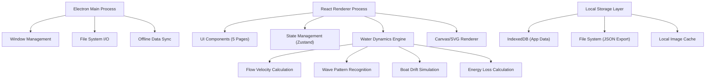
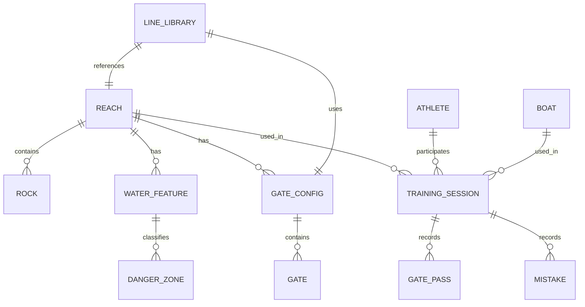

## 1. Architecture Design



## 2. Technology Description

- **Desktop Framework**: Electron@28 - 跨平台桌面客户端，支持离线运行
- **Frontend Framework**: React@18 + TypeScript@5 - 类型安全的组件化开发
- **Build Tool**: Vite@5 - 快速的开发构建工具
- **Styling**: TailwindCSS@3 - 原子化 CSS 框架
- **State Management**: Zustand@4 - 轻量级状态管理，支持持久化
- **Local Database**: IndexedDB (via Dexie.js) - 浏览器端结构化数据存储
- **Data Visualization**: Canvas API + D3.js@7 - 高性能水势渲染与数据图表
- **Icons**: Lucide React - 开源线性图标库
- **Fonts**: Google Fonts (Roboto Slab + Inter) - 专业排版字体

## 3. Route Definitions

| Route | Purpose |
|-------|---------|
| / | 重定向到河段录入页 |
| /reach | 河段录入页 - 基础信息与岩石分布 |
| /reading | 读水标注页 - 水势识别与危险区标注 |
| /gates | 门位编排页 - 门位设置与策略计算 |
| /review | 失误回溯页 - 训练记录与复盘分析 |
| /library | 水势库页 - 成功线路与知识库管理 |

## 4. Data Model

### 4.1 Entity Relationship Diagram



### 4.2 Type Definitions

```typescript
// 河段基础信息
interface Reach {
  id: string;
  name: string;
  length: number; // 米
  width: number; // 平均宽度 米
  location: string;
  baseFlow: number; // 基准流量 m³/s
  drop: number; // 总落差 米
  gradient: number; // 坡度 ‰
  rocks: Rock[];
  createdAt: number;
  updatedAt: number;
}

// 岩石
interface Rock {
  id: string;
  x: number; // 相对坐标 0-1000
  y: number;
  radius: number;
  shape: 'round' | 'sharp' | 'flat' | 'submerged';
  height: number; // 露出水面高度
}

// 水势特征
interface WaterFeature {
  id: string;
  reachId: string;
  type: 'wave' | 'hole' | 'eddy' | 'current' | 'chute';
  x: number;
  y: number;
  width: number;
  height: number; // 浪高/水深
  flowSpeed: number; // 流速 m/s
  direction: number; // 流向角度 0-360
  intensity: 1 | 2 | 3 | 4 | 5; // 强度等级
  flowRange: [number, number]; // 适用流量范围
}

// 危险区
interface DangerZone {
  id: string;
  featureId: string;
  level: 'low' | 'medium' | 'high' | 'extreme';
  description: string;
  riskTypes: Array<'capsize' | 'pin' | 'flush' | 'windowshade'>;
}

// 门位配置
interface GateConfig {
  id: string;
  reachId: string;
  name: string;
  flowRate: number;
  gates: Gate[];
  createdAt: number;
}

// 单道门
interface Gate {
  id: string;
  number: number;
  type: 'upstream' | 'downstream';
  x: number;
  y: number;
  angle: number; // 门的朝向角度
  entryAngle: number; // 计算出的进门角度
  exitDirection: number; // 出门方向
  strokeRhythm: {
    strokes: number; // 桨数
    cadence: number; // 桨频
  };
  driftOffset: {
    lateral: number; // 横推偏移量 m
    leadRequired: number; // 需要的提前量 m
  };
  energyLoss: number; // 能量损耗系数
  switchPoint: {
    type: 'forward' | 'backward' | 'support';
    position: { x: number; y: number };
  } | null;
}

// 训练记录
interface TrainingSession {
  id: string;
  reachId: string;
  gateConfigId: string;
  athleteId: string;
  boatId: string;
  date: number;
  totalTime: number;
  gatePasses: GatePass[];
  mistakes: Mistake[];
  notes: string;
}

// 过门记录
interface GatePass {
  gateId: string;
  time: number; // 过门时间
  targetTime: number;
  deviation: number; // 与目标偏差
  entryAngle: number; // 实际进门角度
  touches: boolean; // 是否碰门
}

// 失误记录
interface Mistake {
  id: string;
  timestamp: number;
  position: { x: number; y: number };
  type: 'touch' | 'miss' | 'capsize' | 'wrong_gate' | 'line_error';
  severity: 1 | 2 | 3;
  readingJudgment: string; // 关联的读水判断
  correction: string; // 纠正方法
}

// 水势库线路
interface LineLibrary {
  id: string;
  name: string;
  reachId: string;
  gateConfigId: string;
  bestTime: number;
  difficulty: 1 | 2 | 3 | 4 | 5;
  flowRange: [number, number]; // 适用流量范围
  segments: LineSegment[];
  tags: string[];
  athleteRating: number;
  createdAt: number;
}

// 线路分段
interface LineSegment {
  id: string;
  startGate: number;
  endGate: number;
  description: string;
  keyPoints: Array<{ x: number; y: number; note: string }>;
  waterFeatures: string[]; // 关联的水势特征ID
}

// 运动员
interface Athlete {
  id: string;
  name: string;
  weight: number; // kg
  height: number; // cm
  skillLevel: 1 | 2 | 3 | 4 | 5;
}

// 艇型
interface Boat {
  id: string;
  model: string;
  type: 'K1' | 'C1' | 'C2';
  length: number;
  width: number;
  weight: number;
  displacement: number; // 排水量
}

// 配重建议
interface WeightRecommendation {
  athleteId: string;
  boatId: string;
  totalWeight: number;
  additionalWeight: number; // 需要增加的配重
  draft: number; // 吃水深度 cm
  centerOfGravity: { x: number; y: number };
}

// 水位风险预警
interface WaterLevelRisk {
  reachId: string;
  currentLevel: number;
  thresholdLevel: number;
  riskLevel: 'normal' | 'warning' | 'danger';
  affectedSegments: string[];
  recommendations: string[];
}
```

## 5. Core Algorithm Modules

### 5.1 水势识别算法
- 输入：流量、落差、岩石分布、坡度
- 输出：水势特征点（翻滚浪、回流区、激流槽等）
- 核心公式：流速 v = k * √(2gH)，其中 k 为摩擦系数，H 为水头

### 5.2 横推偏移模拟
- 基于斜流速度、艇身迎流面积、阻力系数计算侧向偏移
- 反推进门提前量：offset = v_current * t_passage

### 5.3 能量损耗校验
- 动能变化：ΔE = 0.5 * m * (v₂² - v₁²) + m * g * Δh
- 设定阈值，超过则提示路线优化

### 5.4 水位风险评估
- 基于历史数据与水势特征，计算水位上涨对线路的影响
- 分级预警：绿色（安全）、黄色（注意）、红色（危险）

## 6. Offline Support Strategy

### 6.1 Data Persistence
- IndexedDB 存储所有业务数据
- Electron IPC 实现文件系统备份/恢复（JSON 格式）
- 图片资源本地缓存

### 6.2 Feature Availability
- 所有核心功能 100% 离线可用
- 数据导出/导入功能支持跨设备迁移
- 自动保存草稿，防止数据丢失

## 7. Project Structure

```
src/
├── main/                 # Electron 主进程
│   ├── main.ts          # 主入口
│   ├── window.ts        # 窗口管理
│   └── fileManager.ts   # 文件系统操作
├── renderer/            # React 渲染进程
│   ├── App.tsx
│   ├── main.tsx
│   ├── pages/           # 5个页面
│   │   ├── ReachPage/
│   │   ├── ReadingPage/
│   │   ├── GatesPage/
│   │   ├── ReviewPage/
│   │   └── LibraryPage/
│   ├── components/      # 通用组件
│   ├── store/           # Zustand 状态管理
│   ├── engine/          # 水力学计算引擎
│   ├── types/           # TypeScript 类型定义
│   └── utils/           # 工具函数
├── shared/              # 主进程与渲染进程共享类型
└── assets/              # 静态资源
```
