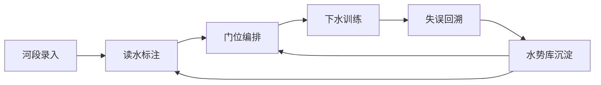

## 1. 产品概述
皮划艇激流路线浪洞读水的水势解析与冲线编排生产力系统，面向激流回旋训练队，提供专业的河段分析、路线规划、训练回溯全流程解决方案。
- 核心价值：将教练经验数字化，通过水力学模型辅助训练决策，提升训练效率和比赛成绩
- 目标用户：激流回旋教练、运动员、战术分析师

## 2. 核心 Features

### 2.1 Feature Module
1. **河段录入页**：基础地理数据录入、流量落差参数配置、岩石分布绘制
2. **读水标注页**：水势识别、翻滚浪/回流区标注、危险区预警、可视化展示
3. **门位编排页**：门位设置、进门角度计算、划水节奏规划、横推偏移模拟、能量损耗校验
4. **失误回溯页**：训练记录管理、过门时间统计、失误点标注、读水判断复盘
5. **水势库页**：成功线路存储、分段水势检索、水位风险预警、配重建议生成

### 2.2 Page Details
| 页面名称 | 模块名称 | Feature description |
|-----------|-------------|---------------------|
| 河段录入页 | 基础信息录入 | 河段名称、长度、平均宽度、地理位置录入 |
| 河段录入页 | 水文参数配置 | 流量(m³/s)、落差(m)、坡度(‰)、水位(m)配置 |
| 河段录入页 | 岩石分布绘制 | Canvas 交互式绘制岩石位置、大小、形状 |
| 河段录入页 | 河段预览 | 河段整体可视化预览与编辑 |
| 读水标注页 | 水势自动识别 | 基于流量/落差/岩石分布算法识别翻滚浪、回流区 |
| 读水标注页 | 手动标注工具 | 手动添加/编辑水势特征点，调整识别结果 |
| 读水标注页 | 危险区标注 | 翻艇危险区自动识别与手动调整，颜色分级显示 |
| 读水标注页 | 流量模拟 | 滑块调整流量，实时预览水势变化 |
| 门位编排页 | 门位管理 | 上下门增删改、位置拖拽调整 |
| 门位编排页 | 角度计算 | 自动计算每道门最优进门角度、出门方向 |
| 门位编排页 | 节奏规划 | 计算出门划水节奏、桨频建议 |
| 门位编排页 | 偏移模拟 | 模拟斜流横推偏移量，反推所需提前量 |
| 门位编排页 | 能量校验 | 校验上下门衔接能量损耗，给出优化建议 |
| 门位编排页 | 切换点推算 | 正划/倒桨支撑最优切换点计算 |
| 失误回溯页 | 训练记录列表 | 按日期/河段筛选训练记录 |
| 失误回溯页 | 过门时间统计 | 每道门通过时间、分段时间、总时间统计 |
| 失误回溯页 | 失误点标注 | 失误类型、位置、原因标注与回溯 |
| 失误回溯页 | 读水复盘 | 关联读水判断，分析决策偏差 |
| 水势库页 | 成功线路列表 | 按河段/难度/成绩检索成功线路 |
| 水势库页 | 分段水势管理 | 水势分段存储、标签化管理 |
| 水势库页 | 水位风险预警 | 水位上涨对路线影响的风险评估与预警 |
| 水势库页 | 配重建议 | 按运动员体重、艇型计算配重与吃水深度建议 |

## 3. Core Process
用户从录入河段数据开始，通过算法识别水势特征，编排门位与冲线策略，记录训练数据并回溯分析，最终将成功经验沉淀到水势库形成知识库闭环。

## 4. User Interface Design

### 4.1 Design Style
- **主色调**：深海蓝 (#0F2B4A) 作为主色，代表水与专业；辅助色采用激流橙 (#FF6B35) 用于强调与预警
- **按钮风格**：微立体圆角按钮，带有微妙的渐变和阴影，hover 时有轻微上浮效果
- **字体**：标题使用 Roboto Slab 衬线字体体现专业感，正文使用 Inter 无衬线保证可读性
- **布局风格**：左侧导航 + 主工作区的双栏布局，工作区内采用卡片式模块化设计
- **图标风格**：线性图标搭配水系蓝色调，关键操作使用实心图标突出
- **数据可视化**：采用 D3.js 实现水势热力图、流线图，Canvas 实现河段交互绘制

### 4.2 Page Design Overview
| Page Name | Module Name | UI Elements |
|-----------|-------------|-------------|
| 河段录入页 | 基础信息表单 | 深色卡片表单，左侧标签右对齐，输入框带验证反馈 |
| 河段录入页 | 岩石绘制区 | 全屏 Canvas，顶部工具栏（画笔/橡皮/形状/撤销），右侧属性面板 |
| 读水标注页 | 水势可视化 | 渐变色彩表示流速，箭头表示流向，不同图标表示浪型 |
| 读水标注页 | 流量模拟滑块 | 底部横向滑块，实时更新水势渲染，带有刻度值 |
| 门位编排页 | 门位管理面板 | 可折叠侧边栏，门位列表带序号，支持拖拽排序 |
| 门位编排页 | 计算结果面板 | 数据卡片网格，角度/节奏/偏移量/能量损耗分卡展示 |
| 失误回溯页 | 时间轴 | 垂直时间轴展示训练记录，点击展开详情 |
| 失误回溯页 | 过门时间图表 | 柱状图对比目标时间与实际时间，红色标注失误点 |
| 水势库页 | 线路卡片 | 封面图+基础信息卡片，hover 显示更多详情，支持收藏 |
| 水势库页 | 风险预警条 | 顶部固定警示条，不同颜色表示风险等级 |

### 4.3 Responsiveness
- 桌面端优先设计，主工作区最小支持 1280px 宽度
- 侧边栏支持折叠，为 Canvas 工作区提供更大空间
- 高分辨率屏幕（2K/4K）适配，矢量图形确保清晰度
- 触控板手势支持：双指缩放河段图、双指平移
